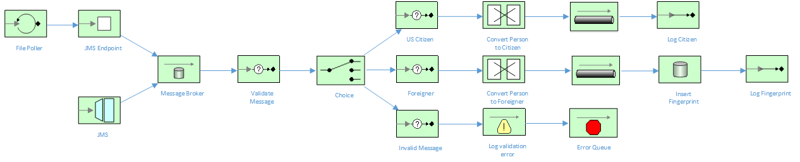

Content Based Routing, JMS Sync / Async and Message Routing in Fuse
=======================================

This project is centered around an immigration processing system, whereby an incoming person XML message is determined to be either a US Citizen, Foreigner or Invalid message.  If the person is a US citizen, they are assigned a random Social Security Number.  If the person is Foreign, they are Fingerprinted and their information is inserted into a database.  Otherwise, if the person XML message is invalid, an excption is thrown and the message is returned to an error queue.

The Camel routes used in this example are explained by the following diagram:

Setup
==============================

You should probably set up the basic developer tools to be able to go through these steps, examples. We will also cover more ideal workflows with developer-local setup of docker and openshift, so would be good to install the "optional" tools as well!

- Install JBoss Developer Studio 9.1.0 GA [https://www.jboss.org/products/devstudio.html]
- Install Apache Maven 3.2.x [http://maven.apache.org]
- Install JBoss Fuse  6.2.1 [https://www.jboss.org/products/fuse.html]

Java Build & Run
==============================

### Build this project

> <project home> $ mvn clean install

## Running locally
You should be able to run this locally using mvn, and it should work as expected. We highly recommend you test your services out locally before packaging as Docker containers:

>  mvn camel:run

Getting Help
============================

If you hit any problems please let the Fuse team know on the forums
  [https://community.jboss.org/en/jbossfuse]
