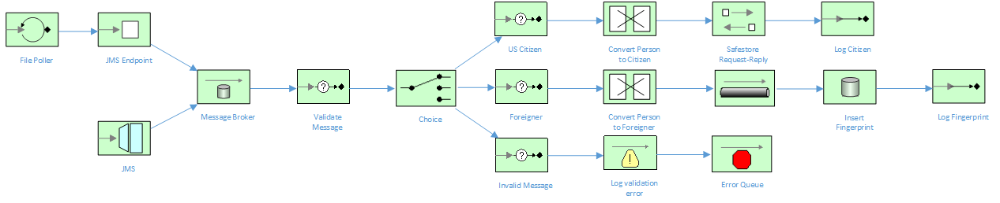

Content Based Routing, JMS Sync / Async and Message Transformation in Fuse and Fuse Integration Services (FIS) 2.0
=======================================

This project is centered around an immigration processing system, whereby an incoming person XML message is determined to be either a US citizen, foreigner or invalid message.  If the person is a US citizen, they are assigned a random Social Security Number (SSN).  If the person is foreign, they are fingerprinted and their information is inserted into a database.  Otherwise, if the person XML message is invalid, an exception is thrown and the message is returned to an error queue.

The Camel routes used in this example are explained by the following diagram:

Setup
==============================

You should probably set up the basic developer tools to be able to go through these steps, examples. We will also cover more ideal workflows with developer-local setup of docker and openshift, so would be good to install the "optional" tools as well!

- Install JBoss Developer Studio 10.3.0 GA [https://www.jboss.org/products/devstudio.html]
- Install Apache Maven 3.3.x [http://maven.apache.org]
- Install JBoss Fuse  6.2.1 [https://www.jboss.org/products/fuse.html]

Java Build & Run
==============================

### Build this project

> <project home> $ mvn clean install

## Running locally
Startup Fuse in the background so that we have a local A-MQ broker running.  Via the command-line, you should be able to run this project locally using mvn, and it should work as expected:

>  mvn camel:run

## Running on JBoss Fuse (Karaf Standalone)
You will need to install this example first:
  
> mvn install

Install Derby database and JDBC connection pool in Fuse with:

> osgi:install -s mvn:commons-pool/commons-pool/1.6

> osgi:install -s mvn:commons-dbcp/commons-dbcp/1.4

> osgi:install -s mvn:org.apache.derby/derby/10.10.1.1

Install into Fuse with:

> features:addurl mvn:org.redhat.examples/transformation-and-cbr/1.0.0-SNAPSHOT/xml/features

> features:install transformation-and-cbr

And you can see the application running by tailing the logs

  log:tail

And you can use ctrl + c to stop tailing the log.

## Running on OpenShift (CDK, Minishift or OpenShift Enterprise)
Once you have your OpenShift environment running, login as the admin user using oc tools.

Ensure you have the FIS / AMQ image streams installed in the OpenShift namespace.  If not, install them using the following command:

> oc project openshift
> BASEURL=https://raw.githubusercontent.com/jboss-fuse/application-templates/GA
> oc replace --force -n openshift -f ${BASEURL}/fis-image-streams.json
> oc replace --force -n openshift -f https://raw.githubusercontent.com/jboss-openshift/application-templates/master/jboss-image-streams.json
> BASEURL=https://raw.githubusercontent.com/jboss-openshift/application-templates/master/amq
> oc replace --force -n openshift -f ${BASEURL}/amq62-basic.json

Next, setup the AMQ 62 basic image in your OpenShift project

> oc new project karaf-amq
> oc process amq62-basic -v APPLICATION_NAME=broker,MQ_USERNAME=admin,MQ_PASSWORD=admin -n karaf-amq | oc create -f -
> echo '{"kind": "ServiceAccount", "apiVersion": "v1", "metadata": {"name": "amqsa"}}' | oc create -f -
> oc policy add-role-to-user view system:serviceaccount:karaf-amq:amqsa

Next, edit the deployment config for the AMQ broker to include the Service Account

> oc edit dc/broker-amq

Add the serviceAccount and serviceAccountName parameters to the spec field, and specify the service account you want to use.

> spec:
>      securityContext: {}
>      serviceAccount: serviceaccount
>      serviceAccountName: amqsa

Update the src/main/resources/amq.properties file and uncomment the following line OpenShift activemq.broker.url property.  Besure to comment the Karaf property that you replace.

Install the example to Openshift using the following commands:

> mvn clean install
> mvn fabric8:deploy

## Testing via the Fuse Management Console

From the Fuse console, select the ActiveMQ tab, and inject sample XML messages (found in src/data) into the payload window:

Getting Help
============================

If you hit any problems please let the Fuse team know on the forums
  [https://community.jboss.org/en/jbossfuse]
